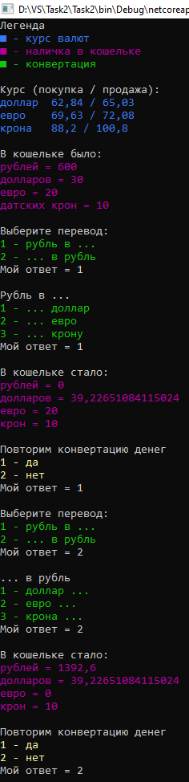

# Lesson2_task2
Условия задачки:
>Используя Visual Studio, создайте проект по шаблону Console Application.  
Требуется:  
Создать класс Converter. 
В теле класса создать пользовательский конструктор, который принимает три вещественных аргумента, и инициализирует поля соответствующие курсу 3-х основных валют, по отношению к рублю - public Converter(double usd, double eur, double dkk).  
Написать программу, которая будет выполнять конвертацию из рубля в одну из указанных валют, также программа должна производить конвертацию из указанных валют в рубль. 

От себя:
>Для подсчета конвертации по сегодняшнему курсу доллара, евро, датской кроны необходимо заменить значения соответствующих параметров руками, в 16 строке Program.cs.

Подытог: вот такенный майндфак на выходе
>
